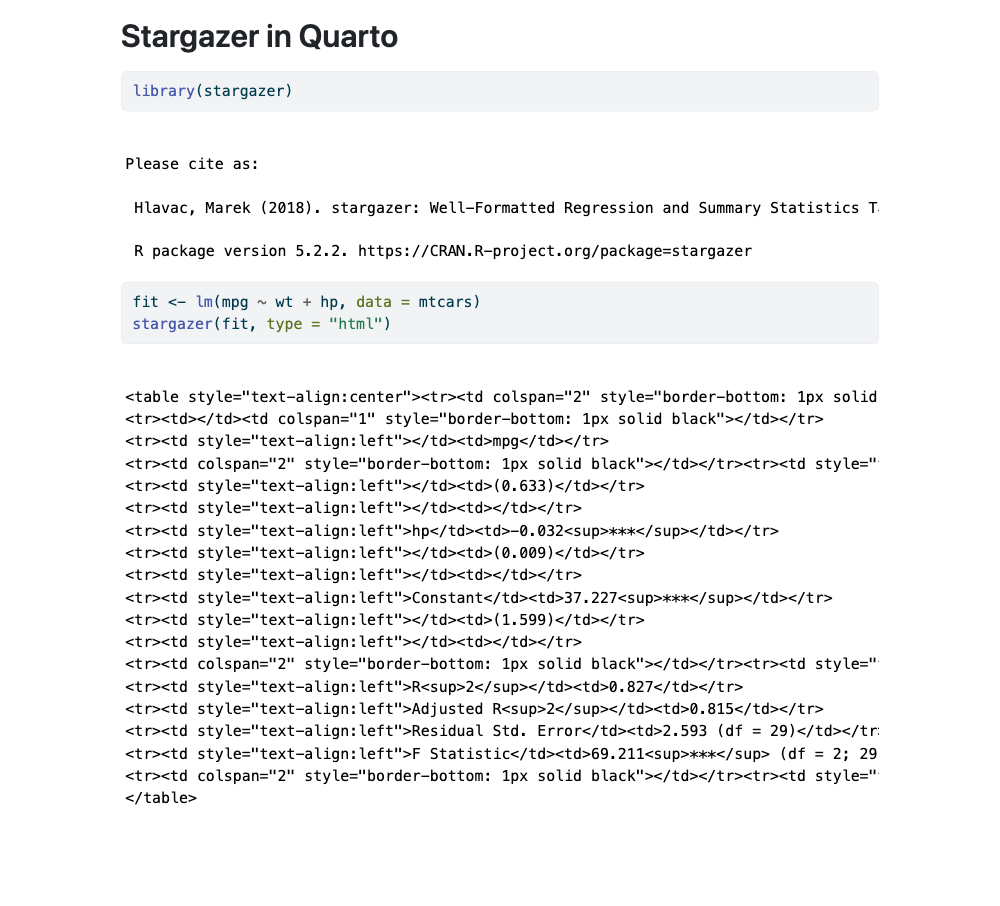
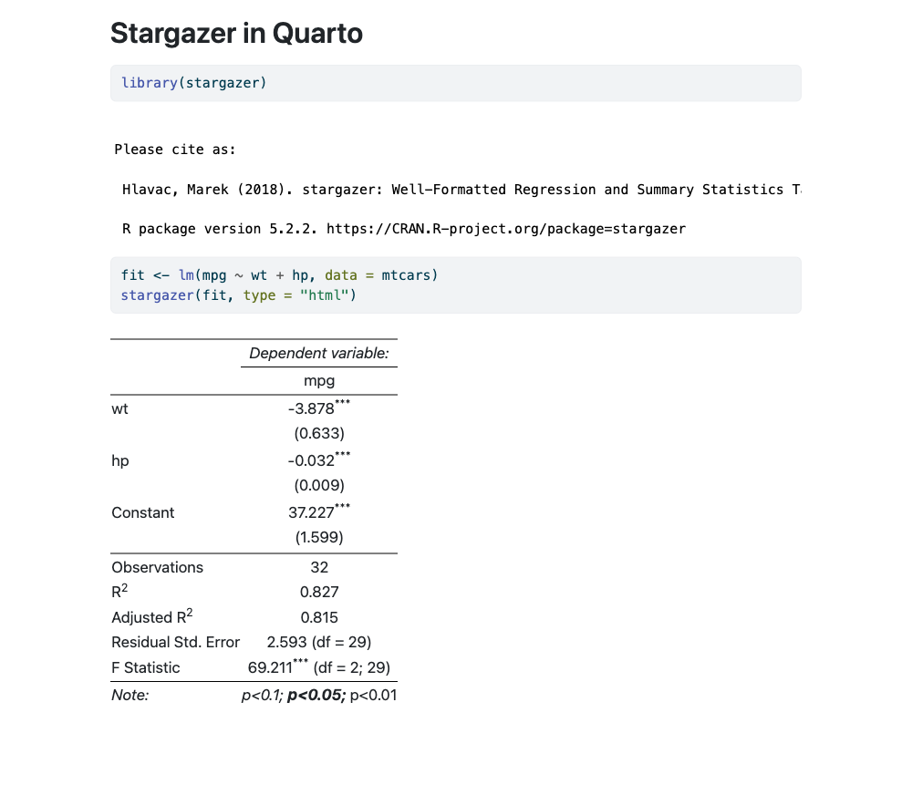
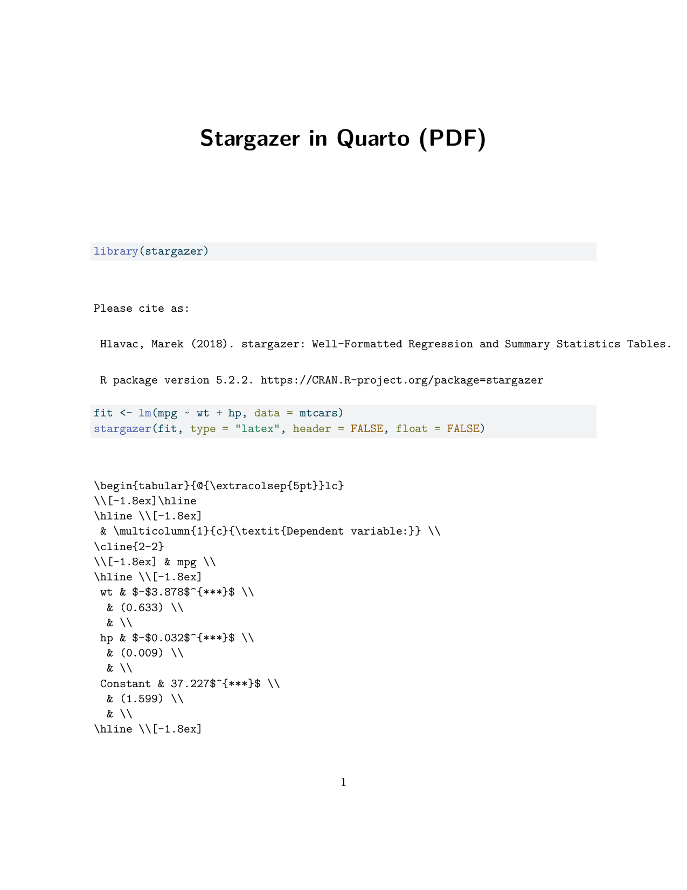
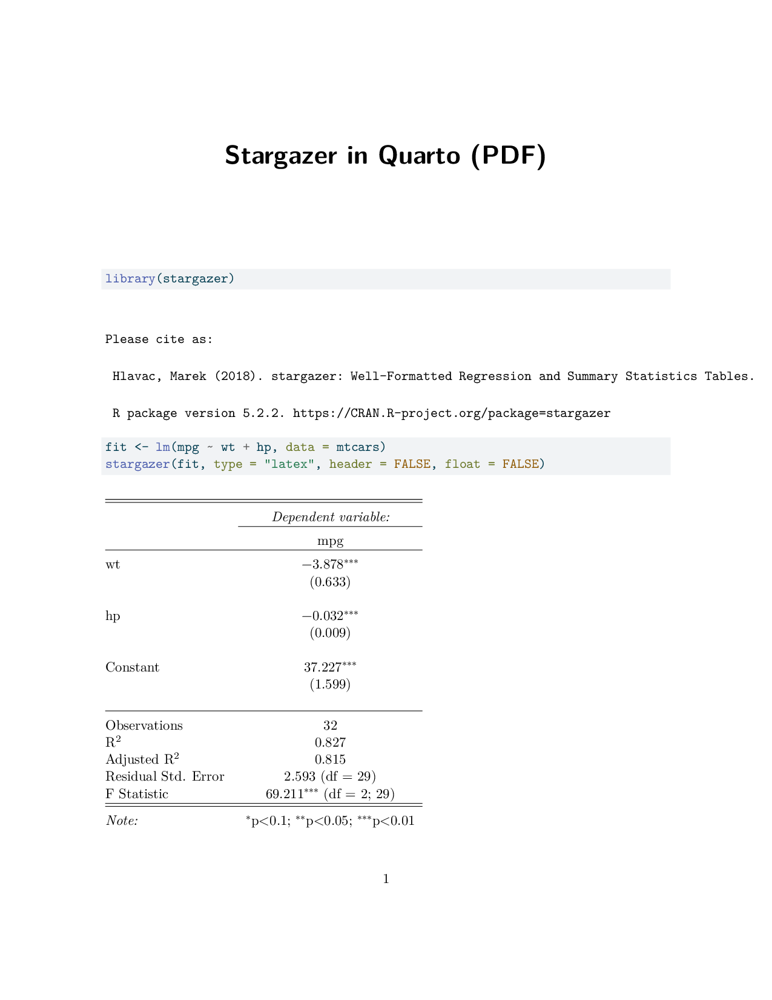

This is a fork of stargazer (under development) intenting to provide support for kable like markdown output. This is useful when working with rmarkdown notebooks and the type="text" output is not fit for your needs.

## Quarto / R Markdown rendering fix

In upstream `stargazer`, calling `stargazer(...)` inside a `.qmd` or `.Rmd` chunk prints escaped HTML / raw LaTeX code instead of a rendered table, unless the user remembers to set `#| results: asis` on every chunk. This fork auto-detects when knitr is executing and wraps the output in `knitr::asis_output()` so tables render correctly with no extra configuration — for both HTML and PDF outputs.

### HTML output (`format: html`, `type = "html"`)

Before — raw HTML leaks into the page as text:

After — the table renders as expected without any chunk options:

### PDF output (`format: pdf`, `type = "latex"`)

Before — raw LaTeX source is printed as verbatim text (and with `float = TRUE` the document fails to compile at all):

After — the LaTeX is interpreted and the table is typeset:

A minimal reproduction lives under [`test_render/`](test_render/).
